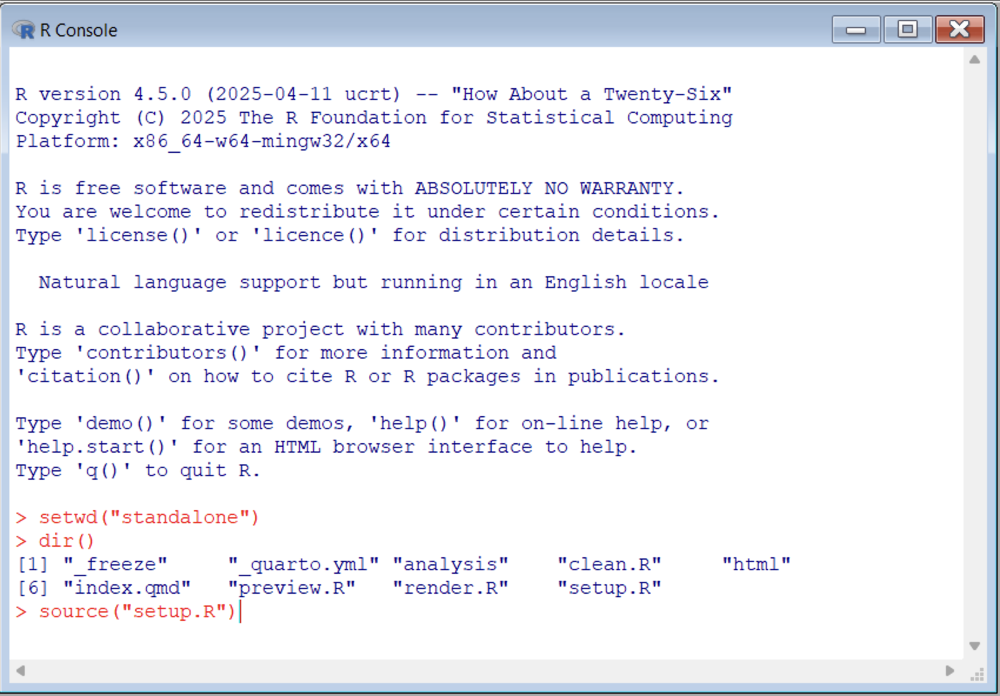
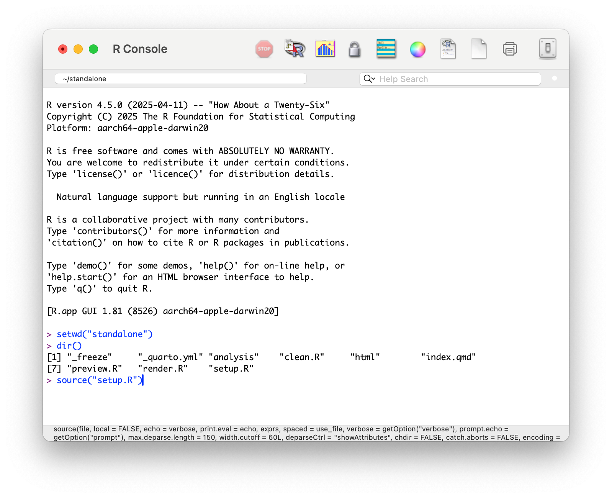

```{r, include = FALSE}
knitr::opts_chunk$set(
  collapse = TRUE,
  comment = "#>"
)
```

quantrr is a streamlined, opinionated, "risk quant on rails" tool designed to make it easy to get started with quantifying risk using R, first presented as a [demo](https://jabenninghoff.github.io/security/analysis/rq-demo.html) in my 2024 [SIRAcon](https://societyinforisk.org) talk, "[UnFAIR: Simplifying and Expanding Technology Risk Quantification](https://www.information-safety.org/2024/08/29/siracon-2024/)." quantrr includes functions and a report template that uses data from an Excel spreadsheet to forecast one or more risks related to a technology system, such as the risk of a cybersecurity breach and the risk of unplanned outages.

I originally wanted to name it "qrisk", but that's already [trademarked](https://qrisk.org).

quantrr can be installed as a standalone application (for novice users) or integrated into your R
development workflow (for advanced users). A rendered version of the standalone sample report is
available [here](../sample/).

## Standalone

The "standalone" version of quantrr provides all the files needed to create reports using quantrr,
and is intended for those who want to get started quickly, or are new to R and don't have an
existing development and publishing workflow. The standalone version requires
[R](https://www.r-project.org) and [Quarto](https://quarto.org).

Note that there are many ways to install and use R and Quarto to generate reports. The instructions
here are designed to make it easy to get started with quantrr. For other approaches, consult the R
and quarto documentation. My setup is documented in
[rdev](https://jabenninghoff.github.io/rdev/articles/rdev.html).

### Install - Windows

To install the standalone version of quantrr on Windows:

1. Download and install the latest version of
   [R for Windows](https://cloud.r-project.org/bin/windows/base/release.html).
1. Download and install [Quarto CLI](https://quarto.org/docs/get-started/).
1. From the "code" menu at <https://github.com/jabenninghoff/quantrr/>, select "Download ZIP".
1. Extract the "standalone" directory from the ZIP file and move it to "Documents"
1. Launch R, and run the following commands:

``` r
setwd("standalone")
dir()
source("setup.R")
```

You should see the following in the R console before executing `source("setup.R")`:



You may see some additional prompts: "Would you like to use a personal library instead?" and "Would
you like to create a personal library <PATH> to install packages into?" If you do, select "Yes" for
both. Additionally, when prompted, choose a Secure CRAN mirror ("0-Cloud [https]").

### Install - macOS

To install the standalone version of quantrr on macOS:

1. Download and install the latest version of
   [R for macOS](https://cloud.r-project.org/bin/macosx/). Choose the appropriate version for your
   hardware (Apple silicon or Intel).
1. Download and install [Quarto CLI](https://quarto.org/docs/get-started/).
1. From the "code" menu at <https://github.com/jabenninghoff/quantrr/>, select "Download ZIP".
1. Extract the "standalone" directory from the ZIP file and move it to your home directory
   ("/Users/<username>").
1. Launch R, and run the following commands:

``` r
setwd("standalone")
dir()
source("setup.R")
```

You should see the following in the R console before executing `source("setup.R")`:



When prompted, choose a Secure CRAN mirror ("0-Cloud [https]"). If you are asked to install the
command line developer tools, please do so.

### Standalone Preview

The [standalone version](../sample/) contains an example analysis for the "Widget Management
System". If everything is correctly installed, running the following command in the R Console will
generate and launch a website locally on your system:

``` r
source("preview.R")
```

Each time you launch R, you will need to set the working directory to the standalone directory
using `setwd("standalone")`. There are three scripts you can use to build and manage the report:

- `source("preview.R")` - generates and launches the report in a web browser
- `source("render.R")` - generates the report and saves it to the html directory
- `source("clean.R")` - deletes all quarto intermediate files and the html directory

### Data Collection

Collect data using a copy of the `widgetsys.xlsx` spreadsheet. The reporting tool uses only two
tabs, "Risks" and "Estimates", all other tabs are ignored.

The Risks sheet is used for scoping the assessment, and has two columns:

1. "Risk", the short name of the risk, also used in the Estimates tab
1. "Description", the long description of the risk

There is no set limit on the number of risks, but each must be unique and there must be at least one
risk.

The Treatments sheet is used for comparing investment (risk treatment) options, and has two columns:

1. "Treatment", the short name of the risk treatment, also used in the Estimates tab
1. "Description", the long description of the risk treatment

The Estimates sheet is used for gathering estimates from Subject Matter Experts, and has 7 columns:

1. "Treatment", the short name of the risk treatment, which must match one of the treatments in the
    Treatment tab
1. "Risk", the short name of the risk, which must match one of the risks in the Risk tab
1. "Expert", the name or identifier of the SME providing the estimate
1. "Frequency (per year)", the average number of times an event is expected to occur per year, used
   as the value of $\lambda$ for the Poisson loss frequency distribution. Fractional values
   represent once every $\frac{1}{x}$ years; once every 4 years is 0.25.
1. "Low (5%)", the estimate of the low (5th percentile) value for a single loss event.
1. "High (95%)", the estimate of the high (95th percentile) value for a single loss event.
1. "Most Likely", the estimate of the median (50th percentile) value for a single loss event.

The Low and High values are used to calculate the parameters for the log-normal loss magnitude
distribution, and the Most Likely is used as a check to see how close the estimates fit log-normal.

SMEs can provide estimates for one or more risks, and their estimates can be left blank. Typically
this is because they have confidence in only the loss frequency *or* loss magnitude.

### Reporting

To generate the report, copy or replace `widgetsys.Rmd` with an updated value for `report_file`, and
appropriate text for the Environment Statement and Import sections. Generate and preview html using
Quarto:

``` r
source("render.R")
source("preview.R")
```

For more information, see the Quarto [documentation](https://quarto.org).

## Integrated

The "integrated" version of quantrr consists of the quantrr package itself, and is intended for
RStudio users who want to integrate it into their existing development and publishing workflow.

### Installing

quantrr is not (yet) available on [CRAN](https://cran.r-project.org). You can install the
development version of quantrr from [GitHub](https://github.com/) using remotes:

``` r
# install.packages("remotes")
remotes::install_github("jabenninghoff/quantrr")
```

Or by using renv:

``` r
# install.packages("renv")
renv::install("jabenninghoff/quantrr")
```

quantrr includes common functions and an
[R Markdown template](https://rstudio.github.io/rstudio-extensions/rmarkdown_templates.html),
"Risk Analysis Report", that can be accessed in RStudio via File > New File > R Markdown... >
From Template.

### Data Collection

As noted above, use the `widgetsys.xlsx` spreadsheet as a template for data collection.

### Reporting

The "Risk Analysis Report" template works as an R Notebook in RStudio, and can be published using
any system that supports R Markdown and HTML widgets (for the dynamic plots using plotly). I publish
to [GitHub Pages](https://pages.github.com) using [rdev](https://jabenninghoff.github.io/rdev/).
